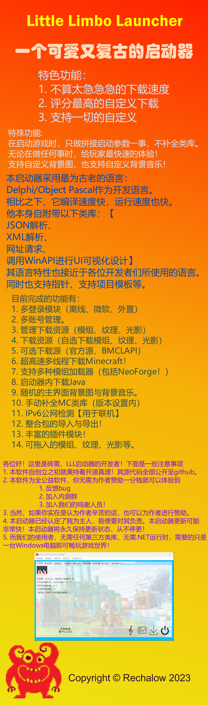

# 大家好，这里是Little Limbo Launcher的介绍界面！！！

- 开源以及下载地址：[点我](https://gitcode.net/rechalow/lllauncher)
- 如果你觉得作者辛苦了，欢迎来给他发电哦！爱发电【以及重要事件诉说】地址：[点我](https://afdian.net/a/Rechalow)

# 为什么你要下载本启动器？

1. 本启动器提供了高高高级自定义功能，将一切的事物全部转交给用户自行处理。
2. 本启动器在启动游戏之时，只做拼接启动参数一事，从来不会检测玩家的类库是否有缺陷，从来不会检测玩家的Java是否有误，一切事物将全部交由用户自行处理，给予用户最高的自定义与随心处理。
3. 本启动器在用户对其进行任何修改时，将只做修改的内容，对于其余的将一概不管，给予用户最为安全的体验与感觉！
4. 不像BakaXL等启动器一般，该启动器在加载任何需求时，都只会给玩家加载那一刻的需求，从来不寻求任何特效体验，完美剔除了BakaXL的冗长加载动画，给予用户最优质的体验！
5. 由于本启动器高度的自定义适配器，导致了用户刚接触该启动器时完全不知道该如何做，那么这里给用户一个非常完美的渠道，您可以加入作者的QQ群，来询问有关启动器的任何事情，作者来者不拒噢！
- 以上为有关于【为什么你要下载本启动器】的须知，各位请过目！

# 这里是Little Limbo Launcher的下载须知：

### 该杀毒报告的启动器版本为：1.0.0-Beta-5

- 以下是杀毒报告：
- 【64-bit】
- 原始文件名：LittleLimboLauncher.exe
- SHA256：bbe38b50bff34a5e7109c499d7214dfdd895f73c17215efbabd07bef82021cf6
- SHA1：b97c70ed6c823cd3f87aa499acf76373b49c7d9b
- MD5：3d03d27ce75a14c9b5ca8e6cf7209935
- 微步云沙箱：[点我](https://s.threatbook.com/report/file/bbe38b50bff34a5e7109c499d7214dfdd895f73c17215efbabd07bef82021cf6)
- VirScan：[点我](https://www.virscan.org/report/bbe38b50bff34a5e7109c499d7214dfdd895f73c17215efbabd07bef82021cf6)
- VirusTotal：[点我](https://www.virustotal.com/gui/file/bbe38b50bff34a5e7109c499d7214dfdd895f73c17215efbabd07bef82021cf6?nocache=1)

- 32位下载链接已失效

- 对于某些可能会报毒的功能，解释如下：例如
1. 使用taskkill结束：这种功能用于结束MC的运行，但与此同时也会结束掉本机上所有使用javaw启动的程序【包括HMCL】
2. 对指定进程感兴趣：此功能用于检测该电脑上是否有使用javaw启动的程序，如果有则将主界面下面的结束MC运行的Button的可使用权解除。
3. 反检测技术：我从没用过这玩意啊！

- =.=.已经彻底的删除了【千万别点】按钮，从现在开始，你将再也看不到我的源码中有任何千万别点的影子了。
- 已经尽可能的去除了程序内所有可能导致系统崩溃或者内存泄漏导致的程序未响应等bug，现在应该没什么问题了吧（
- 本软件仅适用于Windows-64系统，暂不考虑支持其他系统。。

- 目前最新版本：1.0.0-Beta-5